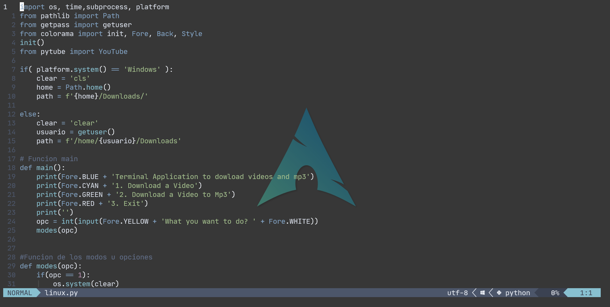
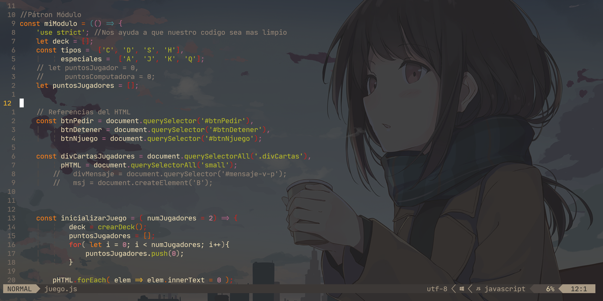

# Configuración de Neovim en Linux

## Para tener a Neovim como casi un IDE


---

> Esta configuracion funciona desde la version 0.7.0 con Lua

## Resultado Final:





### Lista de Plugins de la Configuracion

- [Vim-polyglot](https://github.com/sheerun/vim-polyglot)
- [Vim-devicons](https://github.com/ryanoasis/vim-devicons)
- [Lualine.nvim](https://github.com/nvim-lualine/lualine.nvim) 
- [Fzf.vim](https://github.com/junegunn/fzf) 
- [Vim-signify](https://github.com/mhinz/vim-signify)
- [Supertab](https://github.com/ervandew/supertab) 
- [Nord-vim](https://github.com/arcticicestudio/nord-vim)
- [Vim-tmux-navigator](https://github.com/christoomey/vim-tmux-navigator) 
- [Oceanic-material](https://github.com/glepnir/oceanic-material) 
- [Coc.nvim](https://github.com/neoclide/coc.nvim) 
- [Nvim-treesitter](https://github.com/nvim-treesitter/nvim-treesitter) 
- [Vim-transparent](https://github.com/tribela/vim-transparent) 
- [Vim-repeat](https://github.com/tpope/vim-repeat)
- [Nvim-web-devicons](https://github.com/kyazdani42/nvim-web-devicons) 
- [Auto-pairs](https://github.com/jiangmiao/auto-pairs)
- [Nerdtree](https://github.com/preservim/nerdtree)
- [Vim-react-snippets](https://github.com/mlaursen/vim-react-snippets) 
- [Dracula](https://draculatheme.com/vim)
- [Ultisnips](https://github.com/SirVer/ultisnips) 
- [Indentline](https://github.com/Yggdroot/indentLine) 
- [Emmet-vim](https://github.com/mattn/emmet-vim)
- [Vim-surround](https://github.com/tpope/vim-surround) 
- [Dashboard-nvim](https://github.com/glepnir/dashboard-nvim) 
- [Gruvbox](https://github.com/morhetz/gruvbox)
- [Molokai](https://github.com/tomasr/molokai)
- [Vim-nerdtree-syntax-highlight](https://github.com/tiagofumo/vim-nerdtree-syntax-highlight)
- [Shades-of-purple.vim](https://github.com/Rigellute/shades-of-purple.vim)
- [Nvim-colorizer.lua](https://github.com/norcalli/nvim-colorizer.lua)
- [Nerdcommenter](https://github.com/preservim/nerdcommenter)
- [Onedark.vim](https://github.com/joshdick/onedark.vim)
- [Vim-easymotion](https://github.com/easymotion/vim-easymotion) 
- [Vim-rainbow](https://github.com/frazrepo/vim-rainbow)

## Dependencias de la configuración

### 1. **Neovim** 

#### **Instalar Neovim en Unix, Linux**

Use su manejador de paquetes de confianza apt, dnf, pacman, etc.

Ejemplo en Ubuntu:

```
sudo apt install neovim
```

### 2. **Git** 

* Git es un sistema de control de versiones distribuido. Esto significa que un clon local del proyecto es un repositorio de control de versiones completo. Estos repositorios locales plenamente funcionales permiten trabajar sin conexión o de forma remota fácilmente. 

#### **Instalar Git en Unix, Linux**

Use su manejador de paquetes de confianza apt, dnf, pacman, etc.

Ejemplo en Ubuntu:

```sh
sudo apt install git
```

### 3. **Node js** 

* Node.js, es un entorno en tiempo de ejecución multiplataforma para la capa del servidor (en el lado del servidor) basado en JavaScript. 

#### **Instalar node js en Unix, Linux**

Puede usar su manejador de paquetes de confianza apt, dnf, pacman, etc.

Pero...

Recomiendo instalar nodejs con nvm ( node version manager )

```sh
curl -o- https://raw.githubusercontent.com/nvm-sh/nvm/v0.39.1/install.sh | bash
```

y agregue a su ~/.bashrc o ~/.zshrc 

```sh
export NVM_DIR="$([ -z "${XDG_CONFIG_HOME-}" ] && printf %s "${HOME}/.nvm" || printf %s "${XDG_CONFIG_HOME}/nvm")"
[ -s "$NVM_DIR/nvm.sh" ] && \. "$NVM_DIR/nvm.sh" # This loads nvm
```

## 4. **Nerdfonts**

* Nerd Fonts es un proyecto que parcha las fuentes que un desarrollador va a usar con un número alto de glifos (iconos).

Instala una Nerdfont en tu equipo desde la pagina oficial

<a href="https://www.nerdfonts.com" target="_blank">Nerdfonts</a>

* En Linux tambien las descargas y extraes los archivos y mueve los archivos .ttf y .otf a la carpeta /usr/share/fonts/ 

## 5. **Fzf - Command-line Fuzzy Finder**

* Fzf es un buscador difuso de línea de comandos diminuto, ultrarrápido, de uso general y multiplataforma, que le ayuda a buscar y abrir archivos rápidamente en los sistemas operativos Linux y Windows.

### Instalar Fzf en Linux

Puede instalar lo usando git

```
git clone --depth 1 https://github.com/junegunn/fzf.git ~/.fzf
~/.fzf/install
```

## 6. **Vim Plug**

* Es un administrador de plugins de Neovim y Vim ( Version mejorada del editor de texto vi ) 

#### **Instalar Vim Plug en Unix, Linux**

```sh
sh -c 'curl -fLo "${XDG_DATA_HOME:-$HOME/.local/share}"/nvim/site/autoload/plug.vim --create-dirs \
       https://raw.githubusercontent.com/junegunn/vim-plug/master/plug.vim'
```

Si no cuenta con curl lo puede instalar con el comando apt, dnf, pacman, etc

```
sudo apt install curl
```

## Instalacion de la configuración

### 1. Clona este repositorio

### 2. Respanda tu configuracion de nvim
	 
* Copia todo lo que tengas en __~/.config/nvim__ o donde se encuentre tu ocnfiguración

### 3. Mueve los archivos del repositorio a tu carpeta nvim/

> Para usuarios de Linux cambien la direccion AppData/Local/nvim por ~/.config/nvim/ en los siguientes archivos donde aparezca:

* dashboard.vim
* init.vim 
* plugins.vim

### 4. Instala los Plugins

1. Entra a neovim con el comando, estando dentro del directorio nvim/

```
nvim init.vim
```

2. Ejecuta el siguiente comando en Neovim

```
:PlugInstall
```


Instala las siguientes extensiones de CoC

* coc-prettier
* coc-json
* coc-css
* coc-html

Para instalarlas debes poner el neovim el comando `CocInstall` y luego el nombre de la extensión

```
:CocInstall coc-prettier
```

Atajos de Teclado 

| Key | Action |
| -- | --|
| Space + p | Fzf search in Directory | 
| Space + b | Fzf Buffers |
| Space + uf | Fzf search in ~ | 
| Space + t | Open terminal |
| F3 | Compile current file .cpp |
| F4 | Run current file .cpp | 
| Alt + ] | Move Buffer to right | 
| Alt + [ | Move Buffer to left |
| gd | Go to definition |
| gy | Go to type definition |
| gi | Go to implementation |
| gr | Go to references |
| Space + w | Save file |
| Space + e | Exit without saving |
| Space + q | Exit | 
| Space + s | Plugin EasyMotion-2 |     
| J | Jump 10 lines down | 
| K | Jump 10 lines up | 
| Space + nt | Open NerdTree |
| Space + plug | Install plugins |
| Space + f | Go to end of the line |
| Space + a | Go to the begin of the line |
| Space + nt | Open NerdTree |
| ,, | Esc |
| Alt + k | Show Documentation Hover |
| Space + Y | Copy all content of File |
| Y | Copy to end of the line | 
| Space + cf | Open init.vim |
| Space + bh | Fzf Search in History | 
| Space + ba | Fzf Find File |
| Space + ct | Fzf Change Colorscheme |
| Space + bw | Fzf Search Word |
| Space + bj | Fzf Jump Bookmark |
| Space + nf | Open new file |
| Space + d | Prettier |
| Space + ot | Open Custom terminal - Default powershell |
| Space + rn | Rename symbol | 

~~Listo tienes tu IDE.~~ Listo tienes tu Neovim tuneado :sunglasses:

1. [X] Añadir readme
2. [X] Agregar configuracion
3. [X] Agregar wallpapers
4. [X] Agregar Tabla de Shortcuts 
