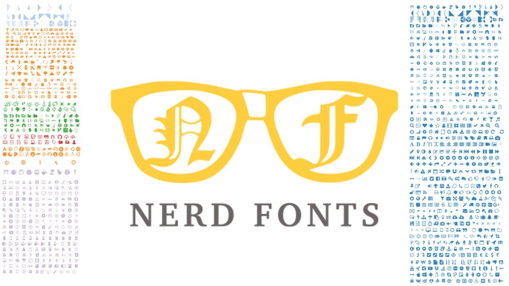

# Configuración de Neovim 

## Para tener a Neovim como casi un IDE


> Esta configuracion funciona desde la version 0.7.0 con Lua

## Dependencias de la configuración

### 1. **Neovim** 

#### **Instalar Neovim en Windows**

Puede usar el manejador de paquetes scoop 

```
scoop install neovim
```

o chocolatey

```
choco install neovim
```

#### **Instalar Git en Unix, Linux**

Use su manejador de paquetes de confianza apt, dnf, pacman, etc.

Ejemplo en Ubuntu:

```
sudo apt install neovim
```

### 2. **Git** 


* Git es un sistema de control de versiones distribuido. Esto significa que un clon local del proyecto es un repositorio de control de versiones completo. Estos repositorios locales plenamente funcionales permiten trabajar sin conexión o de forma remota fácilmente. 

#### **Instalar Git en Windows**

Puede usar el manejador de paquetes scoop 

```
scoop install git
```
O instalarlo desde la pagina oficial

#### **Instalar Git en Unix, Linux**

Use su manejador de paquetes de confianza apt, dnf, pacman, etc.

Ejemplo en Ubuntu:

```sh
sudo apt install git
```

## 3. **Nerdfonts**



* Nerd Fonts es un proyecto que parcha las fuentes que un desarrollador va a usar con un número alto de glifos (iconos).

Instala una Nerdfont en tu equipo desde la pagina oficial

[text-to-highlight](https://www.nerdfonts.com)

<a href="https://www.nerdfonts.com" target="_blank">Nerdfonts</a>

* En Windows la descargas, extraes los archivos, seleccionas las fonts y le das click derecho, instalar.

* En Linux tambien las descargas y extraes los archivos y mueve los archivos .ttf y .otf a la carpeta /usr/share/fonts/ 

## 4. **Vim Plug**


* Es un administrador de plugins de Neovim y Vim ( Version mejorada del editor de texto vi ) 

#### **Instalar Vim Plug en Windows:**

##### Ejecute en Powershell el comando:

```powershell
iwr -useb https://raw.githubusercontent.com/junegunn/vim-plug/master/plug.vim |`
    ni $HOME/vimfiles/autoload/plug.vim -Force
```

#### **Instalar Vim Plug en Unix, Linux**

```sh
sh -c 'curl -fLo "${XDG_DATA_HOME:-$HOME/.local/share}"/nvim/site/autoload/plug.vim --create-dirs \
       https://raw.githubusercontent.com/junegunn/vim-plug/master/plug.vim'
```
## Instalacion de la configuración

### 1. Clona este repositorio

### 2. Respanda tu configuracion de nvim
	 
* Copia todo lo que tengas en __~/.config/nvim__ en unix, linux
* __AppData/Local/nvim__ en Windows

### 3. Mueve los archivos del repositorio a tu carpeta nvim/

### 4. Instala los Plugins

1. Entra a neovim con el comando, estando dentro del directorio nvim/

```
nvim init.vim
```

2. Ejecuta el siguiente comando en Neovim

```
:PlugInstall
```


~~Listo tienes tu IDE.~~ Listo tienes tu Neovim tuneado :sunglasses:

1. [X] Añadir readme
2. [ ] Agregar configuracion
3. [ ] Agregar wallpapers